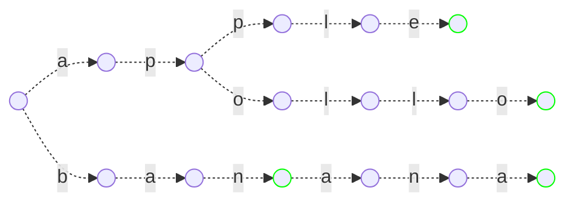

트라이란 문자열의 집합을 트리로 관리하는 자료구조이다. 물론 문자열이 아니더라도 어떠한 시퀀스 정보를 저장하는 데에 쓰일 수 있다. 트라이를 사용하면 문자열 집합에 임의의 문자열이 속하는지를 빠르게 구할 수 있다.

---

다음 문자열 집합을 트라이로 저장해보자.

$$\lbrace\text{apple, apollo, ban, banana}\rbrace$$

저장을 마친 후 트라이의 모습은 다음과 같다. 초록색으로 표시된 노드는 집합 내의 어떠한 단어의 종점임을 나타낸다.



이를 바탕으로 문자열 집합에 특정 문자열이 속하는지를 판별해보자. 트리를 따라가면서 알파벳의 간선이 있는지를 확인하면서 진행하되, 초록색 노드에서 끝나는지를 보면 된다.

- 문자열이 존재하는 경우
    
    💡 주어진 문자열 = $\text{apollo}$
    
    문자열과 매칭되는 루트가 존재하므로 이 문자열은 집합에 존재한다.
    
    ```mermaid!
    graph LR
    
    1 -- <p style="text-shadow: 0px 0px 2px white">a</p> --> 2
    1 -. <p style="text-shadow: 0px 0px 2px white">b</p> .-> 3
    2 -- <p style="text-shadow: 0px 0px 2px white">p</p> --> 4
    4 -. <p style="text-shadow: 0px 0px 2px white">p</p> .-> 5
    5 -. <p style="text-shadow: 0px 0px 2px white">l</p> .-> 6
    6 -. <p style="text-shadow: 0px 0px 2px white">e</p> .-> 7
    4 -- <p style="text-shadow: 0px 0px 2px white">o</p> --> 8
    8 -- <p style="text-shadow: 0px 0px 2px white">l</p> --> 9
    9 -- <p style="text-shadow: 0px 0px 2px white">l</p> --> 10
    10 -- <p style="text-shadow: 0px 0px 2px white">o</p> --> 11
    3 -. <p style="text-shadow: 0px 0px 2px white">a</p> .-> 12
    12 -. <p style="text-shadow: 0px 0px 2px white">n</p> .-> 13
    13 -. <p style="text-shadow: 0px 0px 2px white">a</p> .-> 14
    14 -. <p style="text-shadow: 0px 0px 2px white">n</p> .-> 15
    15 -. <p style="text-shadow: 0px 0px 2px white">a</p> .-> 16
    
    1(( ))
    2(( ))
    3(( ))
    4(( ))
    5(( ))
    6(( ))
    7(( )):::end_flag
    8(( ))
    9(( ))
    10(( ))
    11(( )):::end_flag
    12(( ))
    13(( )):::end_flag
    14(( ))
    15(( ))
    16(( )):::end_flag
    
    classDef end_flag stroke:#0f0
    ```
    
- 문자열이 존재하지 않는 경우
    
    💡 주어진 문자열 = $\text{application}$
    
    문자열과 매칭되는 루트가 존재하지 않으므로 이 문자열은 집합에 존재하지 않는다.
    
    ```mermaid!
    graph LR
    
    1 -- <p style="text-shadow: 0px 0px 2px white">a</p> --> 2
    1 -. <p style="text-shadow: 0px 0px 2px white">b</p> .-> 3
    2 -- <p style="text-shadow: 0px 0px 2px white">p</p> --> 4
    4 -- <p style="text-shadow: 0px 0px 2px white">p</p> --> 5
    5 -- <p style="text-shadow: 0px 0px 2px white">l</p> --> 6
    6 -. <p style="text-shadow: 0px 0px 2px white">e</p> .-> 7
    4 -. <p style="text-shadow: 0px 0px 2px white">o</p> .-> 8
    8 -. <p style="text-shadow: 0px 0px 2px white">l</p> .-> 9
    9 -. <p style="text-shadow: 0px 0px 2px white">l</p> .-> 10
    10 -. <p style="text-shadow: 0px 0px 2px white">o</p> .-> 11
    3 -. <p style="text-shadow: 0px 0px 2px white">a</p> .-> 12
    12 -. <p style="text-shadow: 0px 0px 2px white">n</p> .-> 13
    13 -. <p style="text-shadow: 0px 0px 2px white">a</p> .-> 14
    14 -. <p style="text-shadow: 0px 0px 2px white">n</p> .-> 15
    15 -. <p style="text-shadow: 0px 0px 2px white">a</p> .-> 16
    
    1(( ))
    2(( ))
    3(( ))
    4(( ))
    5(( ))
    6(( )):::error
    7(( )):::end_flag
    8(( ))
    9(( ))
    10(( ))
    11(( )):::end_flag
    12(( ))
    13(( )):::end_flag
    14(( ))
    15(( ))
    16(( )):::end_flag
    
    classDef end_flag stroke:#0f0
    classDef error stroke:#f00
    ```
    
    💡 주어진 문자열 = $\text{bana}$
    
    문자열과 매칭되는 루트는 존재하지만, 초록색 노드에서 끝나지 않으므로 이 문자열은 집합에 존재하지 않는다.
    
    ```mermaid!
    graph LR
    
    1 -. <p style="text-shadow: 0px 0px 2px white">a</p> .-> 2
    1 -- <p style="text-shadow: 0px 0px 2px white">b</p> --> 3
    2 -. <p style="text-shadow: 0px 0px 2px white">p</p> .-> 4
    4 -. <p style="text-shadow: 0px 0px 2px white">p</p> .-> 5
    5 -. <p style="text-shadow: 0px 0px 2px white">l</p> .-> 6
    6 -. <p style="text-shadow: 0px 0px 2px white">e</p> .-> 7
    4 -. <p style="text-shadow: 0px 0px 2px white">o</p> .-> 8
    8 -. <p style="text-shadow: 0px 0px 2px white">l</p> .-> 9
    9 -. <p style="text-shadow: 0px 0px 2px white">l</p> .-> 10
    10 -. <p style="text-shadow: 0px 0px 2px white">o</p> .-> 11
    3 -- <p style="text-shadow: 0px 0px 2px white">a</p> --> 12
    12 -- <p style="text-shadow: 0px 0px 2px white">n</p> --> 13
    13 -- <p style="text-shadow: 0px 0px 2px white">a</p> --> 14
    14 -. <p style="text-shadow: 0px 0px 2px white">n</p> .-> 15
    15 -. <p style="text-shadow: 0px 0px 2px white">a</p> .-> 16
    
    1(( ))
    2(( ))
    3(( ))
    4(( ))
    5(( ))
    6(( ))
    7(( )):::end_flag
    8(( ))
    9(( ))
    10(( ))
    11(( )):::end_flag
    12(( ))
    13(( )):::end_flag
    14(( )):::error
    15(( ))
    16(( )):::end_flag
    
    classDef end_flag stroke:#0f0
    classDef error stroke:#f00
    ```
    
---

아래는 트라이의 기본적인 구현이다. 트리이므로 구현이 어렵지는 않다.

```python
class Trie:
    # 트라이의 각 노드이다.
    # 알파벳 간선과 end_flag를 저장한다.
    class Node:
        def __init__(self):
            self.edge: dict[str: 'Trie.Node'] = { }
            self.end_flag = False

    def __init__(self):
        self.root = Trie.Node()
    
    # 트라이에 문자열을 추가한다.
    def add(self, string: str):
        now = self.root
        for s in string:
            if s not in now.edge:
                now.edge[s] = Trie.Node()
            now = now.edge[s]
        now.end_flag = True
    
    # 트라이에 문자열이 포함되어있는지를 검사한다.
    def contains(self, string: str) -> bool:
        now = self.root
        for s in string:
            if s not in now.edge:
                return False
            now = now.edge[s]
        return now.end_flag
```
<p> 문자열 집합으로부터 트라이를 만들어낼 때의 시간복잡도는 문자열 집합의 모든 문자열의 길이의 합인 $O(\sum{|S|})$이 될 것이다. 그리고 트라이에 임의의 문자열이 존재하는지를 평가할 때의 시간복잡도는 그 문자열의 길이인 $O(|S|)$가 될 것이다. 이는 집합에 속한 모든 문자열에 대해서 일치 여부를 검사하는 시간보다 적다.</p>