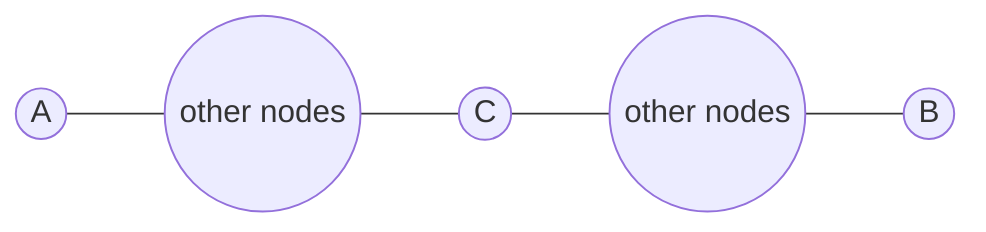
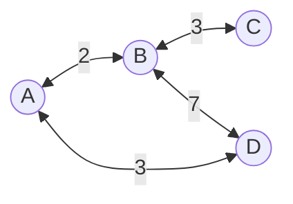

## 소개

플로이드-워셜 알고리즘은 그래프의 모든 정점 간의 최단 거리를 찾는 알고리즘이다. 주로 그래프를 인접행렬로 표현한 상태에서 많이 쓰이는 방법이다. 플로이드-워셜 알고리즘은 어떠한 두 노드 간의 최단 경로를 그 경로의 속한 두 최단 경로의 합으로 생각하는 데서 출발한다.

## 원리
어떠한 두 노드 A와 B 사이의 최단 경로가 다음과 같이 노드 C를 경유한다고 가정하자.



위 그림에서 노드 A와 B 사이의 최단 경로는 노드 A와 C, 노드 C와 B의 최단 경로의 합이라고 생각할 수 있다. 또한 노드 A와 C 사이의 최단 경로는 그 사이의 어떤 노드에 접하는 두 최단 경로의 합으로 생각할 수 있고, 이러한 재귀적인 생각은 두 노드 사이의 경로에 경유하는 노드가 없어질 때까지(즉 두 노드가 직접 연결될 때까지) 반복할 수 있을 것이다. 이를 반대로 생각하면 모든 노드의 직접 연결 정보, 즉 인접행렬을 가지고 모든 노드 사이의 최단 경로를 구하는 알고리즘을 생각해 볼 수 있다. 먼저 다음과 같은 그래프가 있고 이를 인접행렬 $W$로 표현했다고 가정하자.



| $W$ |  A  |  B  |  C  |  D  |
| --- | --- | --- | --- | --- |
|  A  |  0  |  2  |  ∞  |  3  |
|  B  |  2  |  0  |  3  |  7  |
|  C  |  ∞  |  3  |  0  |  ∞  |
|  D  |  3  |  7  |  ∞  |  0  |

연결되어 있지 않은 노드들 간의 거리는 ∞로 초기화한다. 우선 노드 A를 중간 노드로서 경유하는 것부터 생각해보자. 노드 B와 D는 직접 가는 것보다 노드 A를 경유하는 것이 더 거리가 짧다. 즉, 다음을 만족한다.

$$
\displaylines{W[B][D] > W[B][A] + W[A][D] \\ W[D][B] > W[D][A] + W[A][B]}
$$

따라서 $W[B][D]$와 $W[D][B]$을 수정해 다음과 같이 A를 중간 노드로 사용했을 때의 최단 거리 표인 $W_{\lbrace A \rbrace}$을 얻는다.

| $W_{\lbrace A \rbrace}$ |  A  |  B  |  C  |  D  |
| --- | --- | --- | --- | --- |
|  A  |  0  |  2  |  ∞  |  5  |
|  B  |  2  |  0  |  3  |  5  |
|  C  |  ∞  |  3  |  0  |  ∞  |
|  D  |  3  |  5  |  ∞  |  0  |

$W_{\lbrace A \rbrace}$는 다른 말로 하면 이 그래프 상에서 A를 중간 노드로 사용할 수 있을 때의 최단 거리 표이다. 여기서 추가로 노드 B를 중간 노드로 사용하겠다고 선언하자. 우리의 목표는 A와 B를 중간 노드로 사용할 수 있을 때의 최단 거리 표 $W_{\lbrace A, B \rbrace}$를 구하는 것이다. 노드 C는 노드 B를 통해서 A와 D에 닿을 수 있다. 우리는 앞서 $W_{\lbrace A \rbrace}$를 구해놓았으며 $W_{\lbrace A \rbrace}$는 B와 D의 경로가 A를 경유하면 더 빨라진다는 사실을 담고 있다. 따라서 노드 C에서 D를 갈 때 $W_{\lbrace A \rbrace}$를 참고하여 A를 거쳐 가는 더 빠른 경로를 얻을 수 있다. 즉, $W_{\lbrace A, B \rbrace}$를 구할 때는 이전에 구해놓았던 $W_{\lbrace A \rbrace}$을 사용하면 된다는 것을 직관적으로 알 수 있다.

$$
\displaylines{W_{\lbrace A \rbrace}[C][A] > W_{\lbrace A \rbrace}[C][B] + W_{\lbrace A \rbrace}[B][A] \\ W_{\lbrace A \rbrace}[A][C] > W_{\lbrace A \rbrace}[A][B] + W_{\lbrace A \rbrace}[B][C] \\ W_{\lbrace A \rbrace}[C][D] > W_{\lbrace A \rbrace}[C][B] + W_{\lbrace A \rbrace}[B][D] \\ W_{\lbrace A \rbrace}[D][C] > W_{\lbrace A \rbrace}[D][B] + W_{\lbrace A \rbrace}[B][C]}
$$

| $W_{\lbrace A, B \rbrace}$ |  A  |  B  |  C  |  D  |
| --- | --- | --- | --- | --- |
|  A  |  0  |  2  |  5  |  5  |
|  B  |  2  |  0  |  3  |  5  |
|  C  |  5  |  3  |  0  |  8  |
|  D  |  3  |  5  |  8  |  0  |

위의 논리를 계속해서 반복해 $W_{\lbrace A, B, C, D \rbrace}$를 얻자. (실제로 구해보면 갱신될 것이 없으므로 위의 표와 동일하게 나올 것이다.) $W_{\lbrace A, B, C, D \rbrace}$는 A, B, C, D를 중간 노드로 사용할 수 있을 때의 최단 거리 표이며 이는 그래프 상의 모든 노드를 중간 노드로 사용할 수 있다는 뜻이므로 결국 이 그래프 상의 궁극적인 최단 거리 표가 될 것이다.

## 구현

플로이드-워셜의 구현은 굉장히 아름답다. 단순한 3중 반복문이면 되기 때문이다. 중간 노드 $m$을 하나씩 추가하면서 모든 시작점과 종점 쌍 $(s, e)$에 대해서 다음을 수행해주면 된다.

$$
W[s][e] := \min{(W[s][e], W[s][m] + W[m][e])}
$$


```python
from copy import deepcopy


# weight는 간선의 가중치를 나타내는 2차원 배열이다. 즉, 인접행렬이다.
# weight[a][b]는 노드 a에서 b로 가는 간선의 가중치이다.
# 노드 a에서 b로 가는 간선이 없다면 weight[a][b]는 INF이다.
# a == b라면 weight[a][b]는 0이다.
def floyd_warshall(weight: list[list[int]]) -> list[list[int]]:
    result = deepcopy(weight)
    for m in range(len(weight)):
        for s in range(len(weight)):
            for e in range(len(weight)):
                result[s][e] = min(result[s][e], result[s][m] + result[m][e])
    return result

```

플로이드-워셜 알고리즘은 단순 3중 반복문이므로 시간복잡도는 $O(N^3)$이다.
